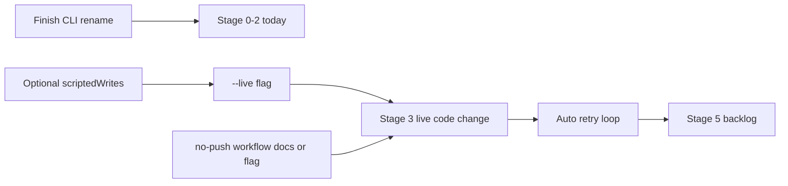

# Snaffle — Backlog & Dogfood Readiness

*Reference for what remains after Phases 1–7. Companion to `deterministic-agent-delivery-pipeline-plan.md` (build plan) and `dogfooding.md` (operator methodology).*

**Last audited:** 2026-06-20

---

## Build plan status

Phases 1–7 in `deterministic-agent-delivery-pipeline-plan.md` are **complete** (342 tests; `bun run check` + `npm run check:node` green).

### Acceptance checklist audit

All phase checklists are fully checked — **121 `[x]` items, zero `[ ]`**:

| Checklist | Checked items |
|-----------|---------------|
| `phase2-acceptance-checklist.md` | 18 |
| `phase3-acceptance-checklist.md` | 20 |
| `phase4-acceptance-checklist.md` | 20 |
| `phase5-acceptance-checklist.md` | 23 |
| `phase6-acceptance-checklist.md` | 21 |
| `phase7-acceptance-checklist.md` | 19 |

The gap is not missing phase work. It is **dogfooding readiness** and **deferred cut lines** that were never scheduled as phases.

---

## What you can do today (no code)

These satisfy **Stages 0–2** in `dogfooding.md` using the existing faux + `scriptedWrites` path:

| Step | Action |
|------|--------|
| **Stage 0** | Copy `docs/dogfood-gate.example.toml` → `.snaffle/gate.toml`; set provider creds and tight budget caps |
| **Stage 1** | `bun run check` green; `bun run snaffle -- status --repo . --limit 20` (wrap mode captures baseline on first PRE gate) |
| **Stage 2** | `bun run snaffle -- run --config-file docs/dogfood-gate.example.toml --task-file docs/dogfood-task.example.json` |
| **Trust window** | With `[hitl].two_way_sample_rate = 1.0`, green two-way runs park → `decisions list` → `decisions approve --lineage <id>` → `resume --lineage <id> --no-push` |

This exercises lock, scope, PRE/POST gate, transitions, provenance, HITL queue, and PR payload rendering — but **not** real model output.

---

## Prioritized backlog

### P0 — Minimum to reach Stage 3 (first live code change)

Blockers from `dogfooding.md` §Current State Caveat:

| ID | Work item | Why | Rough scope |
|----|-----------|-----|-------------|
| **P0-1** | **Optional `scriptedWrites`** | Done — omit for live runs; faux still accepts scripted writes | `src/lib/dogfood-task.ts` |
| **P0-2** | **Live model as a first-class run flag** | Done — `snaffle run --live` (or `SNAFFLE_LIVE_MODEL=1`) | `src/cli.ts`, `src/spine/invoke-agent.ts` |
| **P0-3** | **Document or wire no-side-effect full loop** | `resume --no-push` exists; full-run `--dry-run` does not | **Short path:** document trust-window workflow (sample 1.0 → approve → `resume --no-push`). **Better:** `snaffle run --no-push` through POST gate + park, skipping merge/commit |
| **P0-4** | **Finish CLI rename + install script** | In-progress: `package.json`, `README.md`, `scripts/install-snaffle.mjs` | Land rename; `bun run setup` installs global `snaffle` + routing skills |

**Stage 3 promotion criteria** (`dogfooding.md`):

- At least three trivial two-way changes complete with green POST gates
- Every diff reviewed by a human before merge
- No run changed files outside declared scope
- No run required manual state repair

**Suggested first Stage 3 task:** a leaf file under `docs/` or a small helper in `src/lib/` *outside* the `[door.paths].public_contract` list; narrow scope; `two_way_sample_rate = 1.0`; run with `--live`.

---

### P1 — Minimum for Stage 4 (escalation drills)

| ID | Work item | Why |
|----|-----------|-----|
| **P1-1** | **Automatic failure re-invocation** | Phase 3 cut line; classifier routes but spine never retries. Needed before trusting unattended runs |
| **P1-2** | **Underspecified task → human route** | Stage 4 requires `spec_defect` / `underspecified` to park without burning heavy-tier budget — verify live agents emit evidence the classifier maps correctly |
| **P1-3** | **Operator pause CLI** | `pauseSource: "operator"` exists in budget governor; no CLI to set/clear — useful when debugging runaway loops |

Stage 4 is mostly **exercising** existing one-way doors, PR failure degradation, and failure routing. P1-1 matters if a POST-gate red should retry rather than terminal-fail.

---

### P2 — Minimum for Stage 5 (real backlog)

| ID | Work item | Why |
|----|-----------|-----|
| **P2-1** | **Drop mandatory `scriptedWrites` in task-author docs** | Cursor/Pi snaffle skill still documents it as required |
| **P2-2** | **Escape → criteria loop in practice** | `escapes propose` / `apply-criteria` shipped; needs real escape data from dogfood |
| **P2-3** | **Lower `two_way_sample_rate` gradually** | Config-only after trust window |
| **P2-4** | **npm publish story** | Package is `@orchestrator/spine`, `private: true`, `0.0.0` — blocks OSS distribution per D17/D18 |

---

### P3 — Spec completeness (post-dogfood polish)

Deferred cut lines; not blockers for the first trust window:

| Item | Spec / plan ref | Notes |
|------|-----------------|-------|
| Deterministic-first generate (codemod/template) | §8 step 2, Phase 4 W7 | Zero-token path before model |
| Agent self-check as spine step | §8 step 3 | Skill doctrine only; spine does not enforce affected gate between generate and apply |
| D26 cache-affinity scheduling | Phase 5 cut line | FIFO admission works; tiebreak is cost optimization |
| Rich risk-weighted two-way sampling | Phase 5 cut line | Flat rate is fine for v1 |
| Decision TUI | Phase 5 cut line | CLI sufficient |
| Full governance pack | Phase 6 cut line | Skeleton + name-branching lint shipped |
| Multi-vendor rollout adapters | Phase 7 cut line | Webhook shim exists |
| Live `gh` in default CI | Phase 7 cut line | Mock exec in CI; opt-in with `GH_TOKEN` |

---

### P4 — Explicitly not on the backlog (by design)

| Item | Reason |
|------|--------|
| **Stochastic grader (D24)** | Data-gated future decision; escape instrumentation is the v1 feedback loop |
| **Phase 8 in build plan** | Does not exist; Phases 1–7 are complete |

---

## Dependency graph (P0)

---

## Recommended sequence

1. **Now:** Stage 0–2 with faux + `scriptedWrites` (zero code).
2. **Next code slice:** P0-1 + P0-2 — optional writes + `--live`.
3. **Same or follow-up:** P0-3 (document trust window, or add `run --no-push`).
4. **Operator polish:** P0-4 (CLI rename land).
5. **Run Stage 3:** three boring two-way doc/leaf changes with `--live`, sample rate 1.0, human approve each.
6. **Then:** P1-1 (auto retry) before lowering sample rate or unattended backlog.

**Highest-leverage single task:** P0-1 + P0-2 (optional `scriptedWrites` + `--live` on `snaffle run`) — unblocks Stage 3 without touching gate/scope/spine integrity paths (one-way / `public_contract`).

---

## Related docs

| Document | Purpose |
|----------|---------|
| `deterministic-agent-delivery-pipeline-spec.md` | Architecture and decisions D1–D26 |
| `deterministic-agent-delivery-pipeline-plan.md` | Phase 1–7 build plan (complete) |
| `dogfooding.md` | Operator stages 0–5 and self-editing guardrails |
| `docs/dogfood-gate.example.toml` | Local config template |
| `docs/dogfood-task.example.json` | Task file template |
| `phase*-acceptance-checklist.md` | Per-phase adversarial AC |
